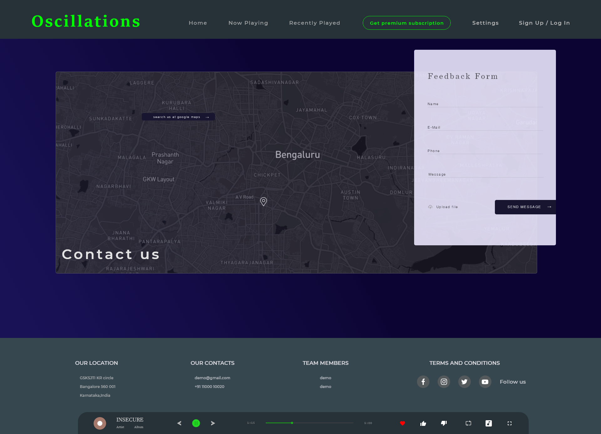
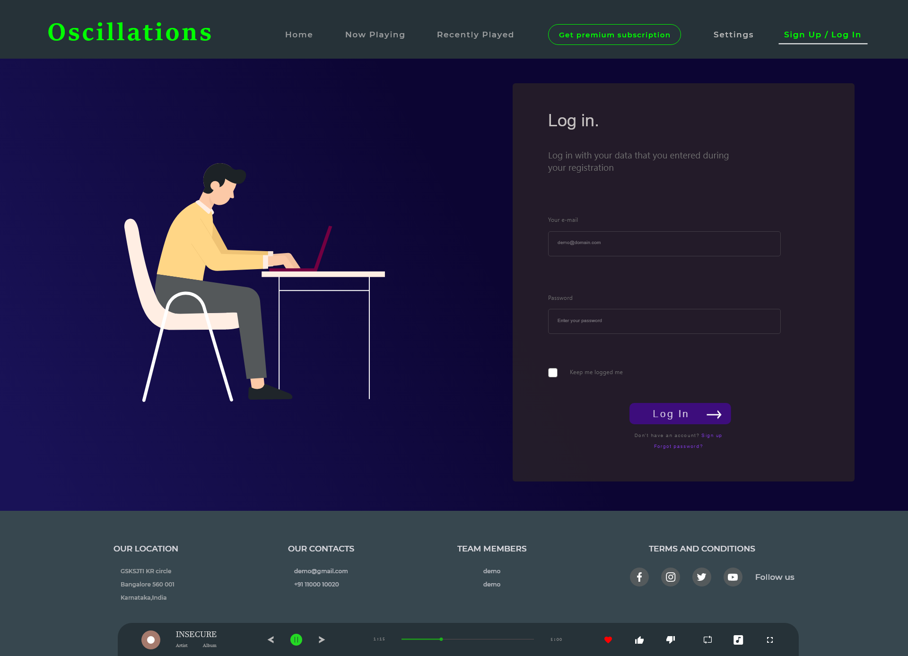

# Music System
The Musical Application Management System is an application built for managing the various functionalities associated with a typical Music Application. In this project various functionalities like playback record, browse history, recently played records and many other useful data is visualized. In the current system the database and server is located locally for the current system hence can be used only in one system. Many a times a user is not given any details pertaining to the playback music like total durations its played, the various attributes related like how many user may have liked or disliked the current music. And other relevent data like the login time, duration, song preferences and other related data.

---
## Essential Components
### React.JS
React can be used as a base in the development of single-page or mobile applications. However, React is only concerned with rendering data to the DOM, and so creating React applications usually requires the use of additional libraries for state management and routing. [https://reactjs.org/](https://reactjs.org/)

---

### Motion Framer
Framer Motion is an animation api shares the simple animation and gesture API as the Framer library, while maintaining HTML and SVG semantics.Helping to create high-fidelity prototypes to a production-ready environment.
[https://www.framer.com/api/motion/](https://www.framer.com/api/motion/)

---

### Glide js
Glide js is a lightweight, flexible and fast slider amd carousel with animation.[https://glidejs.com/](https://glidejs.com/)

---

### D3.JS
D3.JS s a JavaScript library for producing dynamic, interactive data visualizations in web browsers. It makes use of Scalable Vector Graphics (SVG). [https://d3js.org/](https://d3js.org/).

---
### Socket.Io
Socket. IO  enables realtime, bi-directional communication between web clients and servers. It has two parts: a client-side library that runs in the browser, and a server-side library for Node.js. 

---
## Instructions For Executing
The Given **Prototye** take the Given inputs :
- 
>Each time a new user is registered or an existinguser login notification mail is sent to there valid mail id provided during registration

---
> npm install

> npm start 
> The development/ build server of react is lauched at port 3000

---
## Data Visuaization
#### Sequences Sunburst :
Sunburst visualization with data that describes sequences of events. Hover over the segments to see the corresponding sequences. Example [https://observablehq.com/@kerryrodden/sequences-sunburst](https://observablehq.com/@kerryrodden/sequences-sunburst) is generated.

---
#### Zoomable Sunburst :
Zoomable visualization with data that describes sequences of events.Click a node to zoom in, or the center to zoom out. Compare to an icicle.  [https://observablehq.com/@d3/zoomable-sunburst](https://observablehq.com/@d3/zoomable-sunburst) Example is generat

---

# Designs of the Oscillations

1. Home Page Component
   
 

2. Now Playing Page Component
   
 
 
3. Recently Played Music Page Component
 
 

4. Contact and feedback Form Page Component
 
 

5. Log In Existing User Page Component

 

6. User Details and login Page Component

